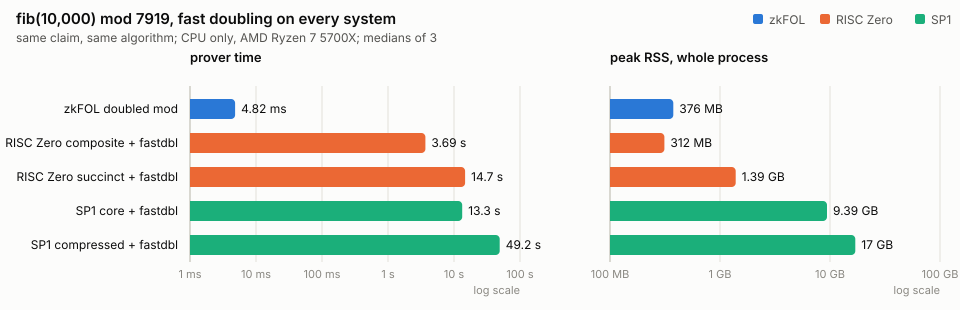
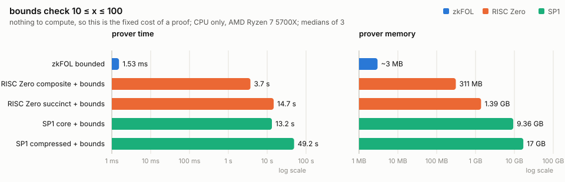
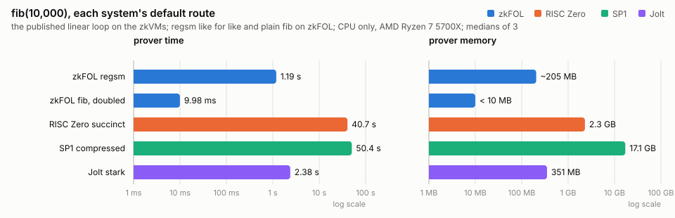
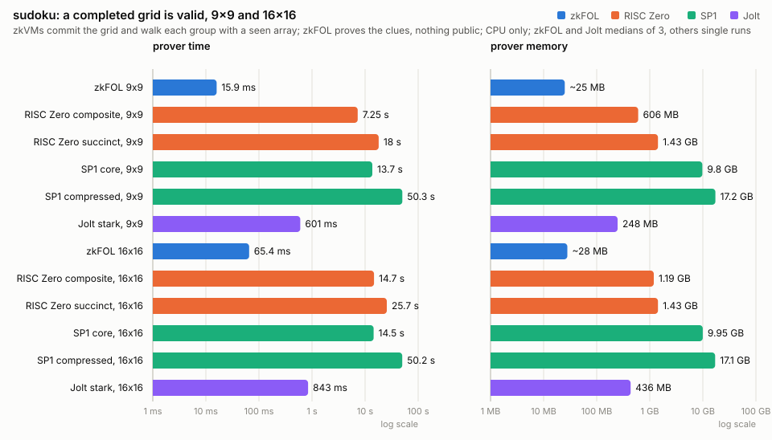

# Benchmarks: zkFOL vs RISC0 vs SP1

We benchmark the same computations on zkFOL, RISC Zero and SP1:

1. **fib(10,000) mod 7919.** Fibonacci run to 10,000, the exact same algorithm on every
   system.
2. **bounds check 10 ≤ x ≤ 100.** Just the cost of constraining the given argument.
3. **fib(10,000).** What just running Fibonacci looks like for your average use case.
4. **Sudoku validity.** A claim with no recurrence at all, only structure — and the one
   place the two sides prove genuinely different statements (see §4).

Each section shows the code each side wrote, complete with imports, then its numbers. The
zkFOL definitions the benchmark ran are collected in [`zkfol/definitions.ex`](zkfol/definitions.ex).

**Machine:** AMD Ryzen 7 5700X (8c/16t), Linux, CPU proving only, one prover at a time.
**Versions:** zkFOL 0.4.0 (zinc-plus `66776a3`; §2 on `7cf72c4`), RISC Zero 3.0.5, SP1 6.3.1.
Measured September 2026.

## Glossary

- **Linear.** Compute fib by walking the recurrence n times: `a, b = b, a + b`. Ten
  thousand steps for n = 10,000.
- **Fast doubling.** Jump instead of walk. From the pair (F(k), F(k+1)) two identities
  give the pair at 2k directly, F(2k) = F(k)(2F(k+1) − F(k)) and F(2k+1) = F(k)² + F(k+1)²,
  so the index doubles each round and n = 10,000 takes 14 rounds instead of 10,000 steps.
  Both algorithms prove the same claim; they differ only in how much work the proof has to
  cover.
- **RISC Zero composite / succinct.** Composite is the raw proof, one STARK per execution
  segment; succinct recursively folds those into one constant-size STARK.
- **SP1 core / compressed.** The same pair for SP1: core is the raw shard proofs,
  compressed recursively folds them into one.

## 1. fib(10,000) mod 7919

Everyone proves fib(10,000) mod 7919 by fast doubling, 14 rounds instead of 10,000 steps.
The zkVM guests use a hand-written `fast_doubling` (source below). zkFOL is handed
`defrel fibm`, the naive two-call recurrence, and `Zkfol.Doubling` rewrites it to the
doubling form.



<table><tr><th><a href="risc0/methods/guest/src/main.rs#L32-L46">RISC Zero guest</a> (hand-written doubling)</th><th><a href="zkfol/definitions.ex#L20-L28">zkFOL</a> (the compiler finds the doubling)</th></tr>
<tr><td>

```rust
use risc0_zkvm::guest::env;

const M: u64 = 7919;

fn fast_doubling(n: u32) -> (u32, u32) {
    let (mut a, mut b): (u64, u64) = (0, 1);
    for i in (0..32).rev() {
        let c = (a * ((2 * b + M - a) % M)) % M;
        let d = (a * a + b * b) % M;
        if (n >> i) & 1 == 0 {
            a = c;
            b = d;
        } else {
            a = d;
            b = (c + d) % M;
        }
    }
    (a as u32, b as u32)
}

fn main() {
    let n: u32 = env::read();
    env::commit(&n);
    let (a, b) = fast_doubling(n);
    env::commit(&a);
    env::commit(&b);
}
```

</td><td>

```elixir
defmodule Fibonacci do
  use Zkfol.Lang

  defrel fibm(1, 1)
  defrel fibm(2, 1)

  defrel fibm(x, v) do
    x > 2
    fibm(x - 1, v1)
    fibm(x - 2, v2)
    v = mod(v1 + v2, 7919)
  end
end
```

</td></tr></table>

| system                                                                   |       prove |     verify |       proof | prover memory |
|--------------------------------------------------------------------------|------------:|-----------:|------------:|--------------:|
| **[zkFOL `fibm`, doubled](zkfol/definitions.ex#L20-L28)**                | **11.48 ms** | **2.30 ms** | **269.8 KB** |   **< 10 MB** |
| [RISC Zero composite + fastdbl](risc0/methods/guest/src/main.rs#L32-L46) |      3.69 s |    11.8 ms |    209.6 KB |        312 MB |
| [RISC Zero succinct + fastdbl](risc0/methods/guest/src/main.rs#L32-L46)  |     14.73 s |    12.4 ms |    223.3 KB |       1.39 GB |
| [SP1 core + fastdbl](sp1/program/src/main.rs#L30-L44)                    |     13.32 s |    74.3 ms |     2.78 MB |       9.39 GB |
| [SP1 compressed + fastdbl](sp1/program/src/main.rs#L30-L44)              |     49.24 s |    32.9 ms |     1.27 MB |      17.00 GB |

Prove, zkVM over zkFOL: 321× / 1,280× / 1,160× / 4,290×. Memory: over 30× / 130× / 900× / 1,700×.

## 2. The floor: a bounds check

Prove that a committed x lies in [10, 100]. Nothing to compute, so this is the price of
a proof at all. RISC Zero charges the same 32,768 cycles here as for fast doubling and for
n = 1; the zkVM columns are unchanged from section 1 because the work never left the floor.



<table><tr><th><a href="risc0/methods/guest/src/main.rs#L59">RISC Zero guest</a></th><th><a href="zkfol/definitions.ex#L51-L54">zkFOL</a></th></tr>
<tr><td>

```rust
use risc0_zkvm::guest::env;

fn main() {
    let x: u32 = env::read();
    env::commit(&x);
    assert!((10..=100).contains(&x), "x out of bounds: {}", x);
}
```

</td><td>

```elixir
defmodule Bounds do
  use Zkfol.Lang

  defrel bounded(x) do
    x > 9
    x < 101
  end
end
```

</td></tr></table>

| system                                                              |       prove |      verify |       proof | prover memory |
|---------------------------------------------------------------------|------------:|------------:|------------:|--------------:|
| **[zkFOL `bounded`](zkfol/definitions.ex#L51-L54)**                 | **1.53 ms** | **0.54 ms** | **28.0 KB** |     **~3 MB** |
| [RISC Zero composite + bounds](risc0/methods/guest/src/main.rs#L59) |      3.70 s |     11.5 ms |    209.6 KB |        311 MB |
| [RISC Zero succinct + bounds](risc0/methods/guest/src/main.rs#L59)  |     14.68 s |     12.3 ms |    223.2 KB |       1.39 GB |
| [SP1 core + bounds](sp1/program/src/main.rs#L56)                    |     13.23 s |     78.2 ms |     2.78 MB |       9.36 GB |
| [SP1 compressed + bounds](sp1/program/src/main.rs#L56)              |     49.20 s |     32.6 ms |     1.27 MB |      17.01 GB |

Prove, zkVM over zkFOL: 2,420× / 9,600× / 8,650× / 32,200×. Memory: 100× / 460× / 3,100× / 5,700×.

## 3. Each system's default route

The zkVMs run the zkbenchmarks.com program unchanged: the linear loop, in their headline
proof mode. zkFOL runs `defrel regsm`, the same linear loop as a relation, for a like-for-like
row, and `defrel fib`, the way a user would write it, on the exact 2,090-digit integer.



<table><tr><th><a href="risc0/methods/guest/src/main.rs#L16-L26">RISC Zero guest</a></th><th><a href="zkfol/definitions.ex">zkFOL</a></th></tr>
<tr><td>

```rust
use risc0_zkvm::guest::env;

fn main() {
    let n: u32 = env::read();
    env::commit(&n);
    let (mut a, mut b) = (0u32, 1u32);
    for _ in 0..n {
        let mut c = a + b;
        c %= 7919;
        a = b;
        b = c;
    }
    env::commit(&a);
    env::commit(&b);
}
```

</td><td>

```elixir
defmodule Fibonacci do
  use Zkfol.Lang

  defrel regsm(1, 1, 1)

  defrel regsm(x, a, b) do
    x > 1
    regsm(x - 1, b, b1)
    a = mod(b + b1, 7919)
  end

  defrel fib(1, 1)
  defrel fib(2, 1)

  defrel fib(x, v) do
    x > 2
    fib(x - 1, v1)
    fib(x - 2, v2)
    v = v1 + v2
  end
end
```

</td></tr></table>

| system                                                        | what is proved               |   prove |  verify |    proof | prover memory |
|---------------------------------------------------------------|------------------------------|--------:|--------:|---------:|--------------:|
| [zkFOL `regsm`](zkfol/definitions.ex#L42-L48)                 | fib(10,000) mod 7919, linear |  1.19 s | 34.1 ms | 922.8 KB |       ~205 MB |
| [zkFOL `fib`, doubled](zkfol/definitions.ex#L9-L17)           | exact fib(10,000), doubling  | 9.98 ms |  3.9 ms | 502.8 KB |       < 10 MB |
| [RISC Zero succinct](risc0/methods/guest/src/main.rs#L16-L26) | fib(10,000) mod 7919, linear | 40.67 s | 12.5 ms | 223.3 KB |       2.30 GB |
| [SP1 compressed](sp1/program/src/main.rs#L14-L24)             | fib(10,000) mod 7919, linear | 50.39 s | 35.2 ms |  1.27 MB |      17.07 GB |

Read the loss column too: on `regsm` zkFOL's verify (34 ms) and proof (923 KB) grow with
the number of steps, while the zkVM's stay constant. `fib` has neither problem because
the compiler rewrites it to doubling, which is why that is the route a user gets by
default.

## 4. Sudoku: a completed grid is valid

A different shape of claim: no recurrence, just structure. Each of the 3n groups — n rows,
n columns, n b×b boxes — must be a permutation of {1,…,n}.

The two sides are **not proving the same thing**, and the difference matters more than the
timings. The zkVM guests take a finished grid and commit it, so they prove *"this public
grid is valid"*. zkFOL proves *"a grid exists satisfying these clues"* — it reports
`public_cols: 0` with `claims: []`, so nothing of the grid is disclosed, where the guests
publish all of it.



<table><tr><th><a href="zkfol/definitions.ex#L60-L91">zkFOL</a> (the groups are relations over the grid)</th><th><a href="risc0/methods/guest/src/bin/sudoku.rs">RISC Zero / SP1 guest</a> (walk each group with a seen array)</th></tr>
<tr><td>

```elixir
defrel sudoku(x, blocks) do
  length(x, n)
  n = blocks ** 2
  blocks > 0
  each(each(between(1, n)), x)
  each(all_distinct, x)
  column(x, cols)
  each(all_distinct, cols)
  boxes(blocks, x, bs)
  each(all_distinct, bs)
end

defrel boxes(n, rows, bs) do
  map(chunk(n), rows, runs)
  chunk(n, runs, bands)
  map(column, bands, stacks)
  map(map(concat), stacks, grouped)
  concat(grouped, bs)
end

defrel column([[] | _], [])

defrel column(rows, [c | cs]) do
  heads(rows, c, rest)
  column(rest, cs)
end

defrel heads([], [], [])

defrel heads([[h | t] | rs], [h | hs], [t | ts]) do
  heads(rs, hs, ts)
end
```

</td><td>

```rust
fn groups(grid: &[u32], n: usize, b: usize) -> Vec<Vec<u32>> {
    let mut g = vec![vec![0u32; n]; 3 * n];
    for r in 0..n {
        for c in 0..n {
            let val = grid[n * r + c];
            g[r][c] = val;
            g[n + c][r] = val;
            let box_id = b * (r / b) + c / b;
            let pos = b * (r % b) + c % b;
            g[2 * n + box_id][pos] = val;
        }
    }
    g
}

fn is_permutation(cells: &[u32], n: usize) -> bool {
    let mut seen = vec![false; n];
    for &v in cells {
        if v < 1 || v as usize > n {
            return false;
        }
        let idx = v as usize - 1;
        if seen[idx] {
            return false;
        }
        seen[idx] = true;
    }
    seen.iter().all(|&s| s)
}

fn box_side(n: usize) -> usize {
    let mut b = 0;
    while (b + 1) * (b + 1) <= n {
        b += 1;
    }
    assert_eq!(b * b, n, "perfect square");
    b
}

fn main() {
    let n: u32 = env::read();
    let grid: Vec<u32> = env::read();
    env::commit(&n);
    env::commit(&grid);

    let n = n as usize;
    assert_eq!(grid.len(), n * n, "");
    let b = box_side(n);

    for group in groups(&grid, n, b).iter() {
        assert!(is_permutation(group, n), "");
    }
}
```

</td></tr></table>

The guests **construct** the 3n groups into a `Vec<Vec<u32>>` and walk each with a `seen`
array; the transposition is imperative data movement done beside the grid. zkFOL says
`column(x, cols)` and `boxes(blocks, x, bs)` as relations and `each(all_distinct, …)` over
them — the rearrangements are read off the grid's own cells. `all_distinct` lowers to
`all_dif` for AL and to `Zkfol.Ast.distinct` for the proof. The two zkVM guests are
character-identical apart from entrypoint boilerplate and their read/commit calls.

| system                                                   | grid  |     prove |   verify |    proof | prover memory |    cycles |
|-----------------------------------------------------------|-------|----------:|---------:|---------:|--------------:|----------:|
| **[zkFOL](zkfol/definitions.ex#L95-L108)**                | 9×9   | **15.95 ms** | **3.38 ms** | 332.3 KB |      **~25 MB** |         — |
| [RISC Zero composite](risc0/methods/guest/src/bin/sudoku.rs) | 9×9   |   7.252 s | 12.46 ms | 221.9 KB |        606 MB |    65,536 |
| [RISC Zero succinct](risc0/methods/guest/src/bin/sudoku.rs)  | 9×9   |  18.040 s | 12.44 ms | 223.9 KB |       1.43 GB |    65,536 |
| [SP1 core](sp1/program/src/bin/sudoku.rs)                | 9×9   |  13.687 s | 75.92 ms |  2.78 MB |       9.57 GB |    77,067 |
| [SP1 compressed](sp1/program/src/bin/sudoku.rs)          | 9×9   |  50.329 s | 33.21 ms |  1.27 MB |      16.80 GB |    77,067 |
| **[zkFOL](zkfol/definitions.ex#L95-L108)**                | 16×16 | **65.42 ms** | **3.54 ms** | 583.7 KB |      **~28 MB** |         — |
| [RISC Zero composite](risc0/methods/guest/src/bin/sudoku.rs) | 16×16 |  14.725 s | 13.23 ms | 246.3 KB |       1.16 GB |   131,072 |
| [RISC Zero succinct](risc0/methods/guest/src/bin/sudoku.rs)  | 16×16 |  25.667 s | 12.67 ms | 225.3 KB |       1.40 GB |   131,072 |
| [SP1 core](sp1/program/src/bin/sudoku.rs)                | 16×16 |  14.470 s | 77.45 ms |  2.78 MB |       9.72 GB |   188,519 |
| [SP1 compressed](sp1/program/src/bin/sudoku.rs)          | 16×16 |  50.169 s | 32.67 ms |  1.27 MB |      16.68 GB |   188,519 |

**The two zkFOL rows are not the same relation.** The 9×9 row is sudoku proper: the clues,
the three distinctness families, and the `between(1, n)` range checks. The 16×16 row carries
the clues and the families but not the range checks, because that is the only order-four
relation the branch defines. So the 9×9 → 16×16 step is not a clean scaling factor — part of
the difference is the grid and part is the missing range checks, and the two cannot be
separated from these rows alone.

Prove at 9×9, zkVM over zkFOL: 455× / 1,130× / 858× / 3,160×. At 16×16:
225× / 392× / 221× / 767×. Memory: 24× to 670× at 9×9, 41× to 600× at 16×16. zkFOL wins
verify on both grids (3.38 ms and 3.54 ms against 12.4 to 77.5 ms), which it does not at
fib(10,000) — the verify win belongs to small claims, so name the size when you quote it.

### Solving, not only checking

The rows above all prove a completed grid, which is the only thing the zkVM guests can
express: their `main` reads a grid, commits it, and asserts each group is a permutation.
There is no path in either guest from the seventeen clues to the grid — a solver would have
to be written as a guest program and proved as one, and it is not what these benchmarks run.

zkFOL derives the grid from the clues directly, because the relations run in both
directions: the same `solved/1` that checks a grid also answers one.

| | solve the 9×9 from its seventeen clues |
|---|---|
| **zkFOL** | **~160 ms** |
| RISC Zero | not expressible — the guest checks a grid it is handed |
| SP1 | not expressible — the guest checks a grid it is handed |

That is a capability difference, not a speed one, so it does not belong in the prove
columns: the proved rows above are a grid the prover already holds, which is the ordinary
shape of a zero-knowledge proof. It is worth stating because "prove sudoku validity" and
"solve a sudoku and prove the answer" are different products, and only one system here
offers the second. The 16×16 has nothing to solve — its head names every cell — so this
applies to the 9×9 alone.

**The cost tracks the pad, not the puzzle.** A third grid size makes this plain. From 4×4 to
16×16 the guest cycles rise 6.9× (27,406 → 188,519) while SP1 compressed moves 49.493 s →
50.169 s, under 1.4%. RISC Zero composite is flat 7.314 s → 7.252 s from 4×4 to 9×9, both
padding to 65,536 cycles, and only doubles at 16×16 when the pad doubles to 131,072.

| system / mode              |    4×4   |    9×9   |   16×16  |
|----------------------------|---------:|---------:|---------:|
| **zkFOL**                  |        — | 15.95 ms | 65.42 ms |
| RISC Zero composite        |  7.314 s |  7.252 s | 14.725 s |
| RISC Zero succinct         | 18.130 s | 18.040 s | 25.667 s |
| SP1 core                   | 13.368 s | 13.687 s | 14.470 s |
| SP1 compressed             | 49.493 s | 50.329 s | 50.169 s |

zkFOL is the only column that responds to the puzzle at all: it rises from 9×9 to 16×16
while SP1 compressed *falls* 0.3% over the same step. Read the zkFOL rise as a direction,
not a factor — the 16×16 relation drops the range checks, so it understates the true cost of
the larger grid. That direction is the point: one column pays for the claim, the other for
the machine.

The zkFOL 4×4 cell is empty because no order-two relation exists: `families` and
`families16` hard-code box side 3 and 4, and the generic `sudoku/2` cannot stand in for them
— run without a `puzzle` clue head it does not lower, the `Zkfol.Phi` pass refusing with
`{:unliftable_term, %{term: :row}}` at every grid size. Filling the cell needs an order-two
puzzle head and a `families4`, not a different call.

## How memory is measured

The zkVM column is the peak RSS of the host process (`ru_maxrss`), which is the prover.
zkFOL's prover runs inside the Erlang VM as a NIF, and the VM idles at 190 to 600 MB
before any proof, so its column is what the prover itself added: the VM's high-water
mark after the peak counter is reset at entry, less its resident size at that moment.
That increment stays under the ~10 MB measurement noise on the doubled fib rows, and is
~25 MB and ~28 MB on the 9×9 and 16×16 sudoku rows, ~205 MB on `regsm`, and ~980 MB on
exact fib(10,000) by the linear route. Whole-process peaks, for reference: 234 to 358 MB
on the small rows, 500 MB on `regsm`, 1.5 GB on the linear exact row. The increment is
order-dependent when rows run back to back in one VM — `regsm` measured 0, 205 and
210 MB across three runs as the heap settled — so treat it as a band, not a point.

## Caveats that ship with the tables

- **CPU only, one box.** zkVM prove times are hardware- and contention-sensitive (RISC
  Zero fib(1000) measured 33 s contended vs 18 s uncontended on this machine). SP1's ~1 s
  setup is excluded from its prove column.
- **Groth16 wraps are not measured** (Docker); vendor figures are unverified here. Wrapped,
  RISC Zero's receipt is 521 bytes with ~3 ms verify, at several times the prove time.
- **Out of bounds is unprovable on both sides**: zkFOL refuses (`no_answer`), the guest
  panics and no receipt is produced.
- **The 16×16 row omits the range checks.** Only the 9×9 row is sudoku proper; the order-four
  relation the branch defines carries the three distinctness families without
  `between(1, n)`. The 16×16 row therefore understates the grid's cost by whatever the range
  checks would add, and the two effects cannot be separated from these rows alone.
- **zkVM sudoku cells are single runs**, not medians of 3 like the fib cells. Where both
  protocols were used on the same cell the two agreed within a few percent, so read the
  sudoku seconds as ±few-percent. The zkFOL rows in §1, §3 and §4 are medians of 3.
- **Sudoku is not like for like.** The zkVM guests commit the grid, so it is public;
  zkFOL publishes none of it. Both prove a completed grid the prover holds — the solve in
  §4 is a separate capability, measured separately, and is not in any prove column. Quote
  the rows with the claim attached, not as a bare speed ratio.
- **Two zinc-plus revisions.** §1, §3 and §4 are `66776a3`; §2 is `7cf72c4`. The prover
  moves quickly between revisions — §1's proof grew from 49.8 KB to 269.8 KB across this
  one — so figures from different revisions are not strictly comparable.

## Reproduce

zkVM cells: `./bench_all.sh` runs every (system, mode, n) sequentially and prints one
`CELL` line each, median of 3, with peak RSS. Rows above are the cells
`<system> <mode>+fastdbl 10000`, `<system> <mode>+bounds 42`, and `<system> <mode> 10000`.

zkFOL rows, one call each, in the zkfol repo at 0.4.0. The definition column links the
relation in [`zkfol/definitions.ex`](zkfol/definitions.ex); the call column is the measuring
example in `Examples.EBench`.

| row             | definition                                                                             | call                                       |
|-----------------|----------------------------------------------------------------------------------------|--------------------------------------------|
| `fibm`, doubled | [`fibm`](zkfol/definitions.ex#L20-L28), rewritten by `Zkfol.Doubling`                  | `measured_doubled_fibonacci_mod(10_000)`   |
| `bounded`       | [`bounded`](zkfol/definitions.ex#L51-L54)                                              | `measured_bounds_check()`                  |
| `regsm`         | [`regsm`](zkfol/definitions.ex#L42-L48)                                                | `measured_registers_fibonacci_mod(10_000)` |
| `regs`          | [`regs`](zkfol/definitions.ex#L32-L38), the exact integer                              | `measured_registers_fibonacci(10_000)`     |
| `fib`, doubled  | [`fib`](zkfol/definitions.ex#L9-L17), the exact integer, rewritten by `Zkfol.Doubling` | `measured_doubled_fibonacci(10_000)`       |

Sudoku cells come from `./run_sudoku.sh <n>` or the binaries directly
(`risc0/target/release/sudoku <n> <mode>`, `sp1/script/target/release/sudoku <n> <mode>`),
one run each with peak RSS taken the same way. The zkFOL sudoku row is the front door
rather than an `EBench` example:

```elixir
Zkfol.eval!(Examples.ESudoku.solved(), Examples.ESudoku.act(), [])
|> Zkfol.Query.statement()
|> Zkfol.compile()
```

with `Zkfol.Log.report(Zkfol.Log.snapshot(), ran)` for the timings.

The definitions in `zkfol/definitions.ex` are for reading; they run inside the zkfol
application, from its shell:

```sh
iex -S mix
```

```elixir
Examples.EBench.measured_doubled_fibonacci_mod(10_000)
```

The figures are drawn from the tables by `elixir chart.exs`.


